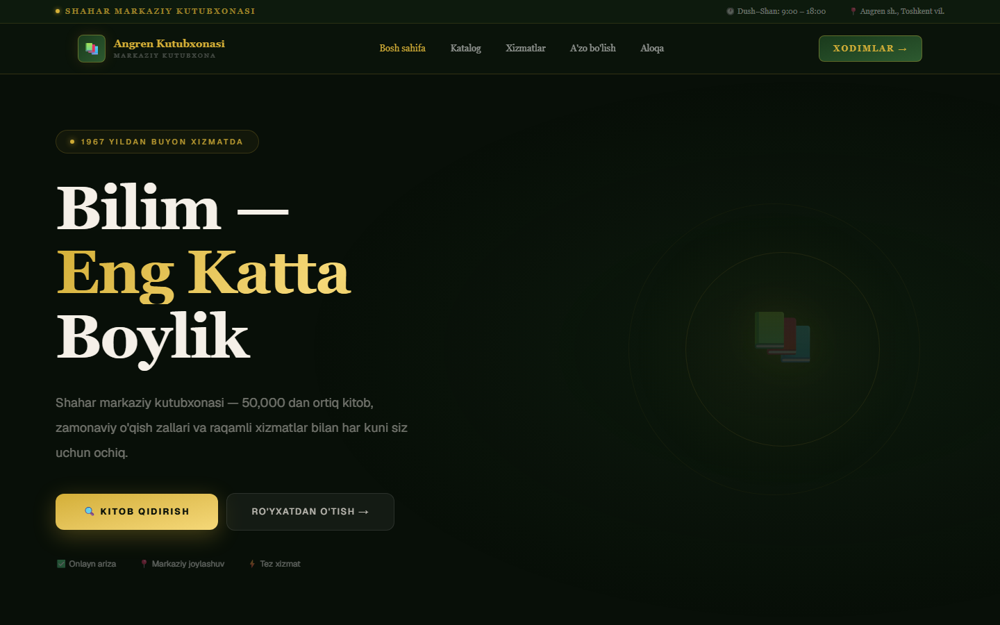
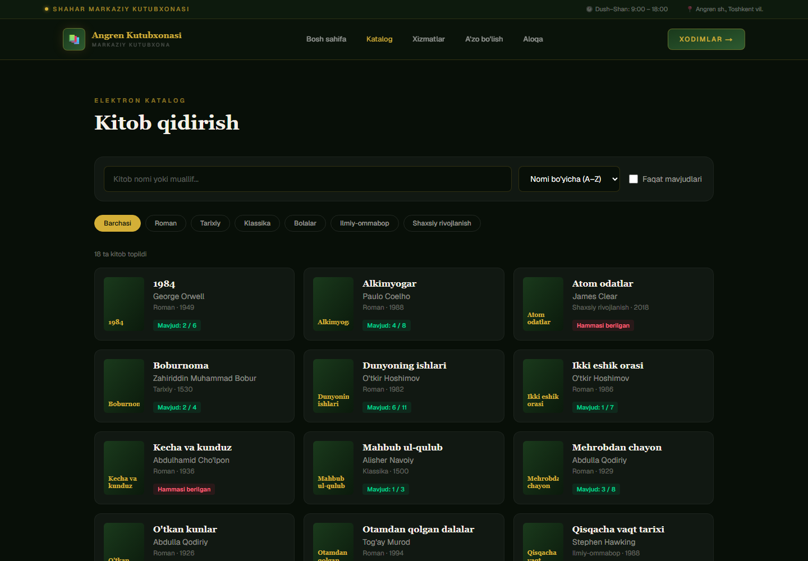

# Angren Kutubxonasi — Library Website & Admin Panel 📚

A redesign concept for a city public library: a responsive public website with a
searchable book catalog and online membership applications, plus a staff admin panel
behind signed-session authentication. The interface is in Uzbek.

> Concept / portfolio project. It is not the library's official website, and all
> people, phone numbers and statistics are placeholders.



## Features

**Public site**
- Dark green and gold design that works on phones and desktops. Animations respect
  `prefers-reduced-motion`.
- **Electronic catalog** (`/kitoblar`): search by title or author, filter by genre,
  sort, and show only available books. Filters live in the URL, so a filtered search
  can be shared as a link.
- **Online membership application** (`/royxat`) with validation. The applicant gets
  a card number straight away, and the application shows up in the admin panel as
  *pending payment*.

**Staff admin panel** (`/admin`)
- Members table with search and status filter, plus stats for total, active, pending
  and revenue.
- Add members, mark a pending application as paid, renew expired memberships and
  delete members.
- Memberships expire on their own after a year. **CSV export** opens correctly in
  Excel (UTF-8 BOM).

**Security**
- Sessions are `user.expiry.HMAC-SHA256` tokens signed with `AUTH_SECRET` (Web Crypto,
  so the same code runs in the edge proxy and in Node). Forged or edited cookies are
  rejected.
- Credentials come only from environment variables. Production refuses to start
  without them.
- Login is rate-limited (5 failed attempts per IP per 15 min). Comparisons run in
  constant time, and the cookie is `httpOnly`, `sameSite=lax` and `secure` in
  production.
- Route protection uses Next.js 16 `proxy.ts`.



## Tech stack

Next.js 16 (App Router, Proxy, Route Handlers) · React 19 · TypeScript · Tailwind CSS 4

## Run locally

```bash
npm install
npm run dev
```

Open <http://localhost:3000>. The staff login is at `/login`. In development, if no
env vars are set, the demo login `admin` / `demo12345` works.

For production, set `ADMIN_USERNAME`, `ADMIN_PASSWORD` and `AUTH_SECRET` (see
[`.env.example`](.env.example)).

## Project structure

```
app/
  page.tsx              home page
  kitoblar/             catalog (client-side search & filters in URL)
  royxat/               membership application form
  login/  admin/        staff login and admin panel
  api/auth/             login (rate-limited) / logout
components/             site header/footer, particles background
lib/auth.ts             signed session tokens, credential check
lib/library.ts          books, members, card numbers, CSV export
proxy.ts                protects /admin
```

Members are kept in `localStorage` so the demo works without a backend. All data
access goes through `lib/library.ts`, which is the one place to connect a real
database.

## License

MIT
